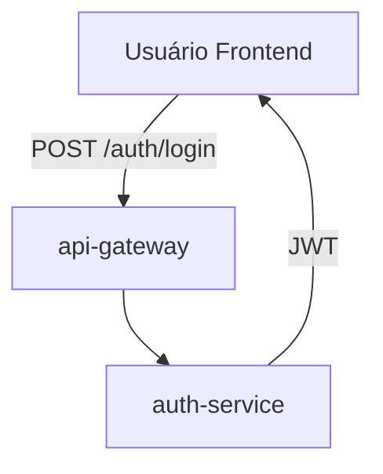
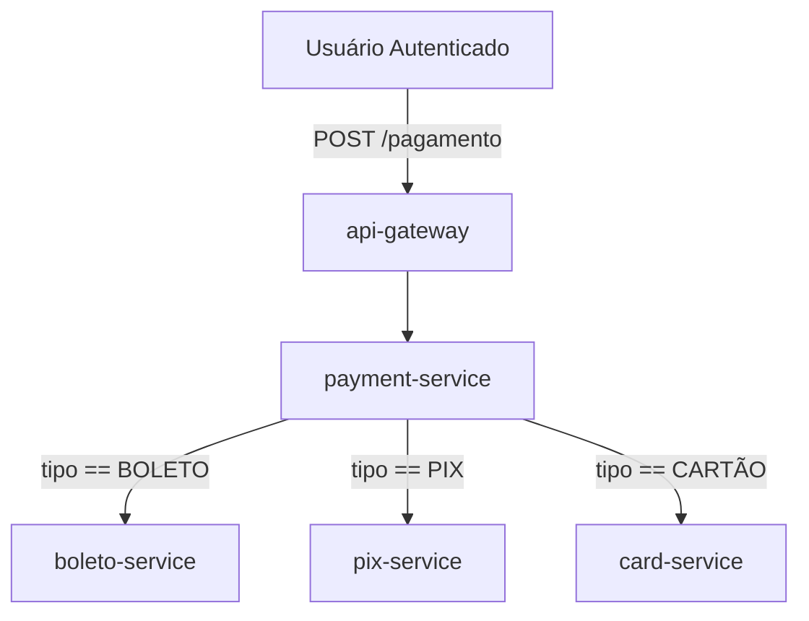
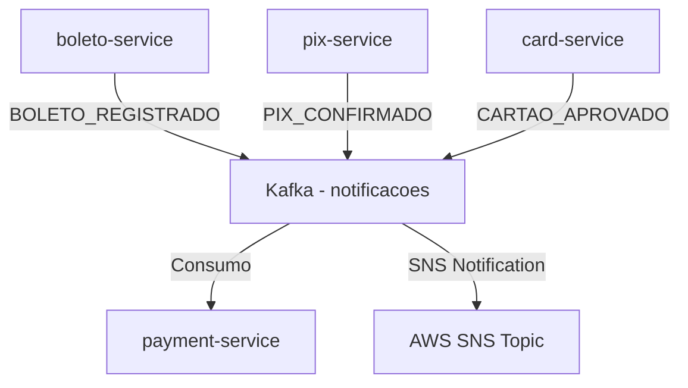
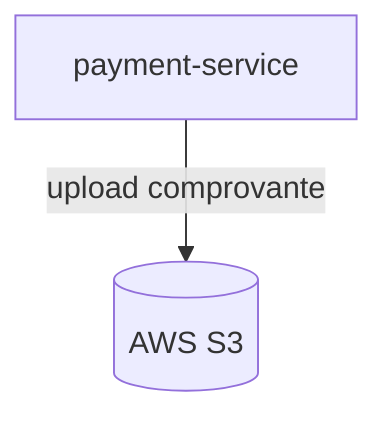

# Fluxo de Comunicação entre Serviços - pagamento-system21

Este documento descreve o fluxo de dados e a interação entre os microserviços do sistema de pagamentos baseado em arquitetura hexagonal.

---

##  Visão Geral dos Serviços

| Serviço           | Descrição                                                 |
| ----------------- | --------------------------------------------------------- |
| `api-gateway`     | Entrada única de requisições (routing + Swagger)          |
| `auth-service`    | Autenticação JWT e emissão de tokens                      |
| `payment-service` | Orquestração de pagamentos (Pix, Boleto, Cartão)          |
| `boleto-service`  | Geração e validação de boletos via Asaas                  |
| `pix-service`     | Geração e validação de chaves e QR codes Pix              |
| `card-service`    | Processamento de pagamentos com cartão                    |
| `common`          | Módulo compartilhado com DTOs, configs, health, messaging |
| `cloud-aws`       | Integração com serviços AWS (S3, SNS, etc)                |

---

##  Fluxo de Pagamento

### 1. Requisição inicial

### 2. Orquestração de pagamento

---

##  Mensageria Assíncrona (Kafka/SNS)

---

##  Armazenamento

---

##  Segurança

* Todos os endpoints passam pelo `api-gateway`, que valida o token JWT
* O token é emitido pelo `auth-service`
* O `common` fornece o modelo `AuthRequest`, `AuthResponse` e JWT utilities

---

##  Observabilidade

* Tracing com `TracingConfig`
* Métricas com `MetricsConfig`
* Logs com `LoggingAspect`
* Health checks: `ReadinessProbe`, `LivenessProbe`, `CustomHealthIndicators`

---

##  Testabilidade

* Testes unitários por camada
* Testes de integração para serviços críticos
* Testes end-to-end via CI/CD workflows (GitHub Actions)

---

##  Observações

* Toda comunicação entre serviços ocorre via REST ou eventos (Kafka)
* O `payment-service` centraliza as decisões de roteamento
* Serviços seguem arquitetura hexagonal, desacoplando domínio da infraestrutura

---

**Autor:** William Silva
**Email:** [williamsilva.codigo@gmail.com](mailto:williamsilva.codigo@gmail.com)
